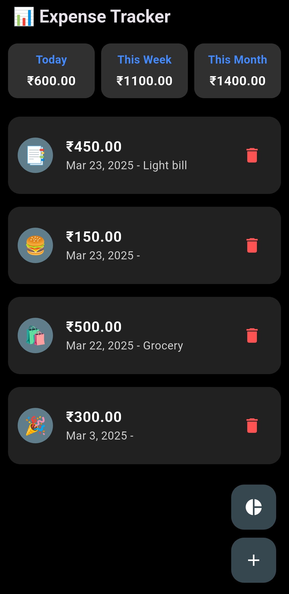
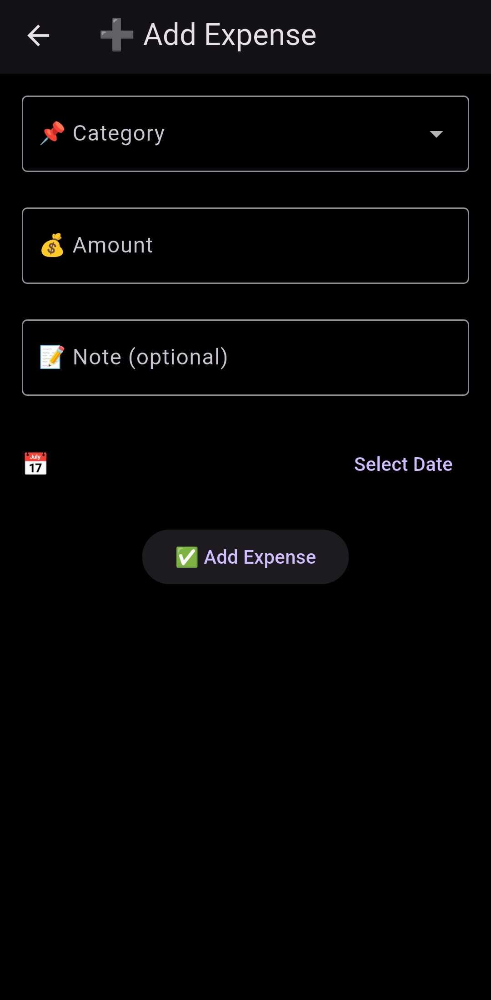
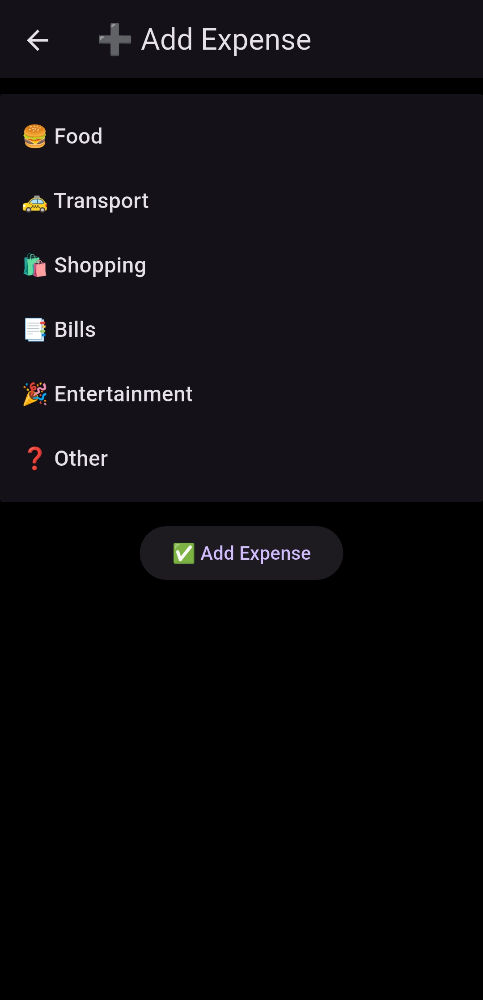

## 💸 **Expense Tracker** 💸 
A sleek/simple and modern Flutter app to track your daily expenses efficiently, with insightful analytics and a dark theme! 🌙✨

🚀 Features -  
✅ Add, Edit & Delete Expenses 📊 
✅ Category-wise Expense Tracking 🏷️ 
✅ Dark Mode Support 🌑 
✅ Summary Cards for Daily, Weekly & Monthly Expenses 📆 
✅ Insights with Charts 📈 
✅ Persistent Storage using Hive 🗄️ 

🛠️ Technologies Used - 
    1. Flutter (UI Framework) 
    2. Dart (Programming Language) 
    3. Provider (State Management) 
    4. Hive (Local Database) 

📜 Project Flowchart - 
The architecture and flow of the app are visually represented below: 

 

📸 Screenshots

<table>
  <tr>
    <td></td>
    <td></td>
  </tr>
  <tr>
    <td></td>
    <td></td>
  </tr>
</table>

🎮 Installation - 
To run the app locally : 
git clone https://github.com/SwarupAusarkar/flutter_expense_tracker.git 
cd expense_tracker 
flutter pub get 
flutter run 

🤝 Contributing 
Feel free to contribute by submitting a pull request!